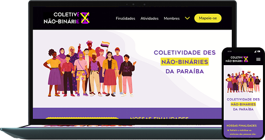
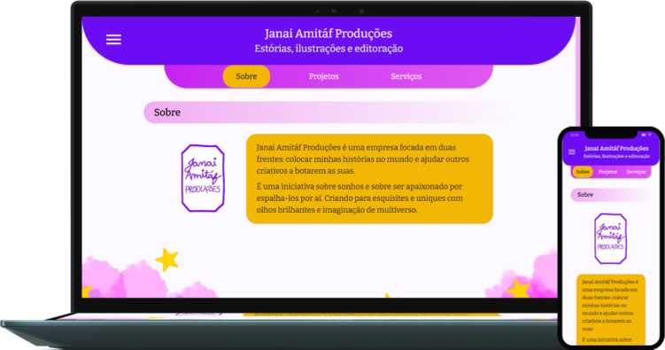

  Sou Desenvolvedore Front-end apaixonade por transformar ideias em experiências digitais <strong>acessíveis, intuitivas e visualmente consistentes</strong>. Minha atuação combina <strong>Desenvolvimento Front-end e UI/UX Design</strong>, unindo tecnologia, criatividade e atenção às necessidades das pessoas usuárias. Tenho um olhar especial para <strong>acessibilidade web</strong>, buscando construir interfaces mais inclusivas, responsivas e fáceis de navegar, sem deixar de lado estética, usabilidade e qualidade técnica. Gosto de trabalhar de forma colaborativa, valorizando comunicação, aprendizado contínuo e o desafio de transformar problemas em soluções digitais que façam sentido.

## 🩷 Projetos

 

   
   
 

## 🩷 Tecnologias

 
 
 
 
 
 
 
 
 
 
 
 
 
 
 

## 🩷 Badges
 
 

   
 

## 🩷 Vamos nos conectar

 
 
 [_98144--8264-FFC8DD?style=for-the-badge&logo=whatsapp&logoColor=black&logoSize=auto&color=FFC8DD&cacheSeconds=3600&link=https://wa.me/5583981448264?text=Ol%C3%A1,%20Enne!%20Tudo%20bem?%20%C3%89%20um%20prazer%20conhecer%20o%20seu%20trabalho%20e%20eu%20gostaria%20de%20saber%20mais%20sobre.%20S2)](https://wa.me/5583981448264?text=Ol%C3%A1,%20Enne!%20Tudo%20bem?%20%C3%89%20um%20prazer%20conhecer%20o%20seu%20trabalho%20e%20eu%20gostaria%20de%20saber%20mais%20sobre.%20S2)
 

